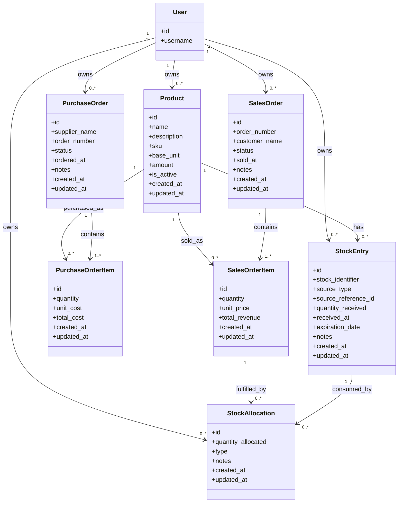

# Inventory Management System

Inventory management application for Food & Beverages CPG brands.

Deployed app: [inventory-management-system-367.vercel.app](https://inventory-management-system-367.vercel.app)

## Table of Contents

- [Overview](#overview)
- [Tech Stack](#tech-stack)
- [Local Setup](#local-setup)
- [Testing](#testing)
- [Deployment](#deployment)
- [Scope Delivered](#scope-delivered)
- [Architecture](#architecture)
- [Authentication](#authentication)
- [Main Screens](#main-screens)
- [API Overview](#api-overview)
- [Data Model](#data-model)
- [Technical Decisions](#technical-decisions)

## Overview

The system lets each authenticated user manage:
- products
- stock entries
- purchase orders
- sales orders
- financial analysis

Superusers can also manage application users through a dedicated manager area.

It is built with a Django REST API and a React + TypeScript frontend. Data is isolated per user, stock movements are traceable, and profit reporting is calculated on the backend.

## Tech Stack

### Backend
- Django 4
- Django REST Framework
- Simple JWT authentication
- PostgreSQL
- pytest + pytest-django

### Frontend
- React 18
- TypeScript
- TanStack Query
- Mantine
- React Router
- Vite

## Local Setup

### Prerequisites
- Python 3.11+
- Node.js 18+
- PostgreSQL 16+ or Docker

### Running locally with Docker

This is the easiest local setup.

What it does:
- runs PostgreSQL in one container
- runs Django plus the built React frontend in one app container
- exposes the whole application on a single URL: `http://localhost:8000`

Start the application:

```bash
docker compose up --build
```

Open:

```text
http://localhost:8000
```

Demo login:

```text
username: DEMO
password: demo1234
```

Create a superuser locally:

```bash
docker compose exec app python manage.py createsuperuser
```

Stop the application:

```bash
docker compose down
```

Reset the database:

```bash
docker compose down -v
docker compose up --build
```

Notes:
- The Docker setup is for local usage only.
- It does not replace the current Vercel frontend deployment or Railway backend deployment.
- The app container runs Django migrations automatically on startup.
- If you reset the database, create the superuser again because the previous one will be removed.


## Testing

### Backend tests

```bash
cd backend
./venv/bin/python -m pytest
```


### Frontend build check

```bash
cd frontend
npm run build
```

## Deployment

This project supports three different run/deployment paths:

- Local Docker:
  `docker-compose.yml` starts Postgres in one container and the app in another container.
  The app container builds the React frontend and serves it through Django on `http://localhost:8000`.
- Railway backend:
  `backend/railway.json` supports the backend deployment flow used on Railway.
- Vercel frontend:
  `frontend/vercel.json` supports the frontend deployment flow used on Vercel.

Important:
- The Docker setup is only for local execution.
- Cloud deployment splits between Vercel for the frontend and Railway for the backend.

## Scope Delivered

### Core flows
- Register products with `name`, `description`, `sku/code`, unit, and amount
- Support product units: `kg`, `g`, `L`, `mL`, `unit`
- Add stock manually or from purchase orders
- Give each stock entry a unique identifier (`STK-000001` style)
- Create purchase orders with item quantities and unit costs
- Receive purchase orders into stock entries
- Create sales orders with quantities and selling prices
- Allocate sales against specific stock entries
- View revenue, purchase cost, COGS, profit, and profit margin in the financial dashboard
- Allow superusers to list, create, and edit application users

### Business rules
- Users only access their own records
- SKU is unique per user
- Purchase order totals are recalculated from `quantity * unit_cost`
- Sales order totals are recalculated from `quantity * unit_price`
- Selling more stock than available is rejected
- Purchase orders must be fully received before being marked as `received`
- Sales orders must be fully allocated before being marked as `confirmed`
- Profit = `revenue - cost`
- Profit margin = `(profit / cost) * 100`, with zero-cost handled safely

### Stock movement logic

Inventory is modeled as explicit in and out movements instead of a single mutable stock number.

- Inbound stock is stored in `StockEntry`
- Outbound stock is stored in `StockAllocation`
- Each `StockAllocation` is linked to a specific `StockEntry`
- This means stock is consumed from a concrete inbound lot/batch, not only from the product in general
- That relationship keeps inventory traceability intact from stock received to stock consumed
- Available quantity for a stock entry is `quantity_received - sum(quantity_allocated)`
- Product availability is the sum of available quantities across all stock entries for that product

Typical traceable flow:
- A purchase order item is received
- One or more `StockEntry` records are created
- A sales order is created
- One or more `StockAllocation` records consume quantity from those stock entries

Flexible operational flow:
- A user can create a manual `StockEntry` when stock is added without a purchase order
- A user can create a manual `StockAllocation` when stock leaves inventory without a sale
- Manual allocations can represent losses such as expiration, damage, or other inventory adjustments

This structure keeps stock history auditable and also supports financial traceability when the movement is linked to purchase and sales records.

## Architecture

### Backend apps
- `products`: catalog and product-level inventory summary
- `stocks`: stock lots, availability, allocation traceability
- `purchase_orders`: purchasing workflow and stock receiving
- `sales_orders`: selling workflow and stock allocation
- `finance`: product and purchase-item profitability views
- `users`: authenticated user scoping base behavior

### Frontend modules
- Authentication
- Dashboard
- Products
- Stocks
- Purchase Orders
- Sales Orders
- Financial Dashboard
- Manager Users

## Authentication

The application uses token-based authentication with JWT.

This choice keeps the backend stateless, works well with a separate React frontend, and is simple to use for protected API requests. After login, the frontend authenticates subsequent requests with the issued token, while the backend validates the user identity on every call.

Authorization is enforced through user-level data ownership: all main business records belong to a specific user, and the API only exposes records owned by the authenticated user. This guarantees data isolation across products, stock entries, purchase orders, sales orders, and stock allocations.

The application also includes role-based access for administration tasks: the manager area is restricted to superusers, who can manage application users separately from regular inventory data.

## Main Screens

- Login
- Dashboard with quick actions
- Product list, create, edit, detail
- Stock list, create, edit, detail
- Purchase order list, create, edit, detail, receive flow
- Sales order list, create, edit, detail, allocation flow
- Financial dashboard with product and purchase-item perspectives
- Manager user list, create, and edit pages for superusers

## API Overview

Base URL: `/api/`

All main resources follow standard REST operations:
- `GET /resource/`: list user records
- `POST /resource/`: create a record
- `GET /resource/{id}/`: retrieve one record
- `PUT/PATCH /resource/{id}/`: update a record
- `DELETE /resource/{id}/`: delete a record

Authentication is required for all business endpoints. Each response is scoped to the authenticated user.

### Authentication
- `POST /api/token/`
  Returns JWT access and refresh tokens for login.
- `POST /api/token/refresh/`
  Refreshes the access token using a valid refresh token.
- `GET /api/auth/me/`
  Returns the authenticated user profile used by the frontend session and role-aware navigation.

### User Management
- `/api/users/`
  Superuser-only user management endpoints.
  Used by the manager area to list, create, retrieve, and update application users.

### Products
- `/api/products/`
  Manage the product catalog.
  Stores product identity fields such as name, description, SKU, unit, and amount.
- `GET /api/products/{id}/stock_summary/`
  Returns aggregated stock information for a product, including total available quantity, total inventory value, and entry-level availability.

### Stock Entries
- `/api/stock-entries/`
  Manage inbound stock lots/batches.
  A stock entry can come from a purchase order or be created manually.
- `GET /api/stock-entries/{id}/allocation_detail/`
  Returns the traceability view for one stock entry, including received quantity, current available quantity, allocated quantity, and related allocations.

### Purchase Orders
- `/api/purchase-orders/`
  Manage purchase order headers.
  Used to create, edit, list, and retrieve supplier orders.
- `/api/purchase-order-items/`
  Manage purchase order line items.
  Each item stores the product, purchased quantity, unit cost, and recalculated total cost.
- `POST /api/purchase-orders/{id}/confirm/`
  Moves a purchase order from `draft` to `confirmed`.
- `POST /api/purchase-orders/{id}/cancel/`
  Cancels a purchase order that is still in a reversible state.
- `POST /api/purchase-orders/{id}/receive_with_entries/`
  Completes the receiving workflow.
  This endpoint creates the related `StockEntry` records and marks the purchase order as `received`.
  It requires explicit received entries so stock traceability is preserved.
- `POST /api/purchase-orders/{id}/reopen/`
  Reopens a received purchase order back to `confirmed`.
  If stock entries were already created, the endpoint requires confirmation to delete them before reopening.

### Sales Orders
- `/api/sales-orders/`
  Manage sales order headers.
  Used to create, edit, list, and retrieve customer sales.
- `/api/sales-order-items/`
  Manage sales order line items.
  Each item stores the product, sold quantity, selling price, and recalculated total revenue.
- `POST /api/sales-orders/{id}/cancel/`
  Cancels a sales order.
- `POST /api/sales-orders/{id}/confirm_with_allocations/`
  Completes the sales confirmation workflow.
  This endpoint creates `StockAllocation` records, validates that available stock is sufficient, and marks the sales order as `confirmed`.
  It requires explicit allocations so each outbound movement is tied to a specific stock entry.
- `POST /api/sales-orders/{id}/reopen/`
  Reopens a confirmed sales order back to `draft`.
  If allocations already exist, the endpoint requires confirmation to delete them before reopening.

### Stock Allocations
- `/api/stock-allocations/`
  Manage outbound inventory records.
  Allocations are normally created from sales orders, but they can also represent non-sale losses such as expired or damaged stock.
  Each allocation points to a specific stock entry to preserve inventory traceability.

### Financial Endpoints
- `/api/finance/products/`
  Returns financial metrics aggregated by product.
  Used by the financial dashboard to show revenue, purchased value, COGS, profit, margin, purchased quantity, sold quantity, and remaining quantity.
- `/api/finance/purchase-items/`
  Returns financial metrics from the purchase-item perspective.
  Useful to analyze how a specific received purchase line performed over time.

### Common query capabilities

Several list endpoints support project-level filtering patterns such as:
- search
- ordering
- filtering by related ids
- date filtering on finance endpoints

Examples:
- product search by SKU or name
- stock entries filtered by product or source type
- purchase orders searched by order number, supplier, product name, or SKU
- sales orders searched by order number, customer, product name, or SKU
- finance endpoints filtered by selected ids, search, `start_date`, and `end_date`

## Data Model

Main entities:
- User
- Product
- StockEntry
- PurchaseOrder
- PurchaseOrderItem
- SalesOrder
- SalesOrderItem
- StockAllocation

Relationship summary:
- A user owns all business data
- A product has many stock entries
- A purchase order has many purchase order items
- Receiving a purchase order creates stock entries
- A sales order has many sales order items
- Confirming a sales order creates stock allocations from stock entries

### Database UML



Notes:
- `StockEntry` is the inbound inventory record
- `StockAllocation` is the outbound inventory record
- Each allocation points to a specific stock entry to preserve batch/lot traceability
- `StockEntry.source_reference_id` is used when the entry comes from a purchase order item
- A sales allocation is typically linked to a `SalesOrderItem`, but allocations can also be used for non-sale losses such as expiration or damage

## Technical Decisions

- Django apps split by domain to keep logic easy to explain
- DRF viewsets and serializers used for consistent CRUD APIs
- JWT used for simple frontend/backend authentication
- Stock is tracked as individual entries/lots so allocations remain traceable
- Financial calculations are kept on the backend to make results consistent across the UI
- TanStack Query is used for API fetching, caching, and mutation invalidation
- Mantine is used for a fast, clean admin-style UI without heavy custom state management
